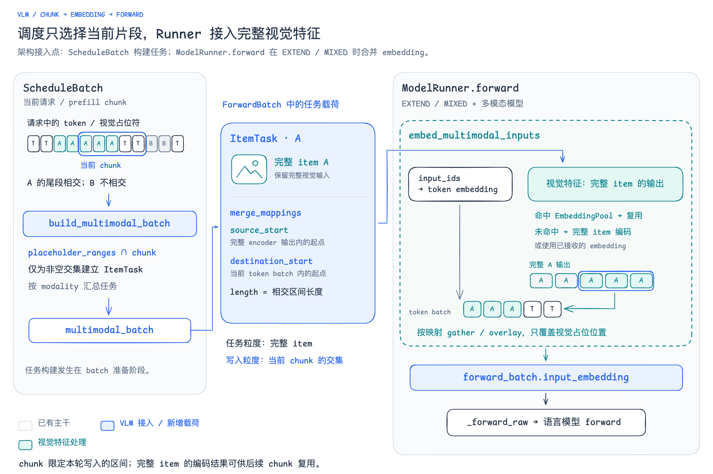

# Chunk 任务与 embedding 的架构接入

[可编辑 Excalidraw](excalidraw/11-vlm-chunk-embedding-integration.excalidraw) · [SVG](excalidraw/11-vlm-chunk-embedding-integration.svg)

建议放在介绍 `build_multimodal_batch` 与 `ModelRunner.forward` 的两段文字之后：图展示 Scheduler、任务载荷与 Runner 之间的接入边界，与前面的 chunk 索引图互补。

Scheduler 只为与当前 chunk 相交的占位区间生成任务，任务携带完整 item，以及从完整 encoder 输出到当前 token batch 的映射。Runner 在多模态模型的 EXTEND / MIXED 路径中取得完整视觉特征，按映射覆盖 token embedding 的视觉位置，设置 `forward_batch.input_embedding` 后继续语言模型 forward。

## 实现细节与来源

- [ScheduleBatch 构建 multimodal_batch](https://github.com/primatrix/sglang-jax/blob/2b1c144b588166e80d783f392258e5382d937a07/python/sgl_jax/srt/managers/schedule_batch.py#L3174)：EXTEND / MIXED 时调用任务构建函数。
- [任务构建与映射](https://github.com/primatrix/sglang-jax/blob/2b1c144b588166e80d783f392258e5382d937a07/python/sgl_jax/srt/multimodal/in_model/host_orchestration.py#L49)：每个 item 可包含多个占位区间；`source_start` 累计此前区间长度，`destination_start` 包含当前请求在 DP token batch 内的偏移，`length` 为交集长度。
- [embedding 合并](https://github.com/primatrix/sglang-jax/blob/2b1c144b588166e80d783f392258e5382d937a07/python/sgl_jax/srt/multimodal/in_model/host_orchestration.py#L423)：先初始化 token embedding；缓存命中时 gather 已有输出，未命中时解析完整 item 的本地编码或预计算 embedding，再按映射 overlay。启用 EmbeddingPool 时，仅对仍有未合并尾部的本地编码 item 写入缓存，后续 chunk 可命中复用。
- [Runner 接入点](https://github.com/primatrix/sglang-jax/blob/2b1c144b588166e80d783f392258e5382d937a07/python/sgl_jax/srt/model_executor/model_runner.py#L941)：要求模型满足 `InModelMultimodalContract` 且模式为 EXTEND / MIXED；赋值后调用 `_forward_raw`。支持 DeepStack 的模型还会设置对应 embedding 与开关，图中聚焦基础输入路径。

图中方块 A / B 表示两个 item 的视觉占位位置或输出行，T 表示普通 token；示例当前 chunk 仅覆盖 A 的尾段与后续两个文本 token。全部文字使用 Comic Shanns，仅保存在本地仓库，未上传至 Outline。
