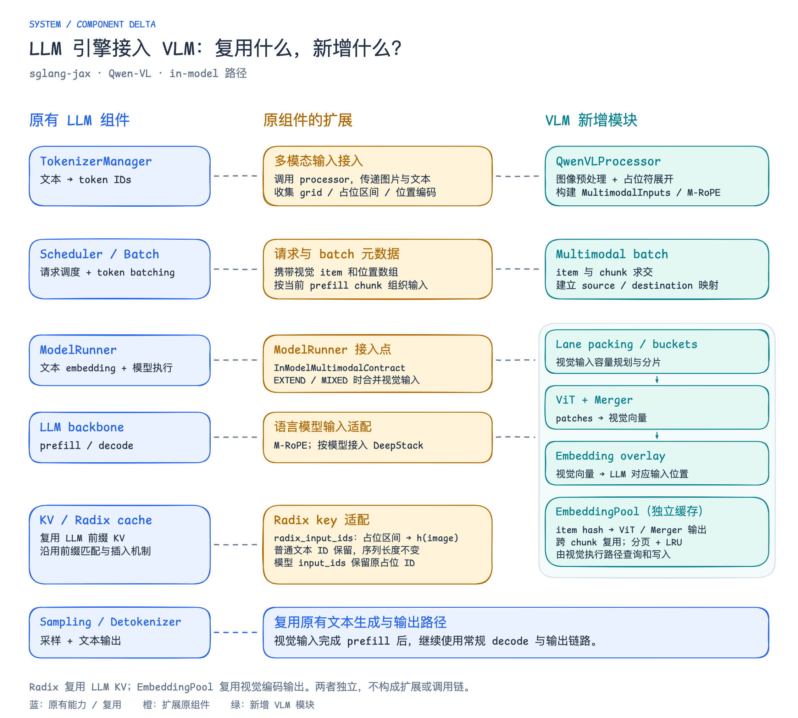
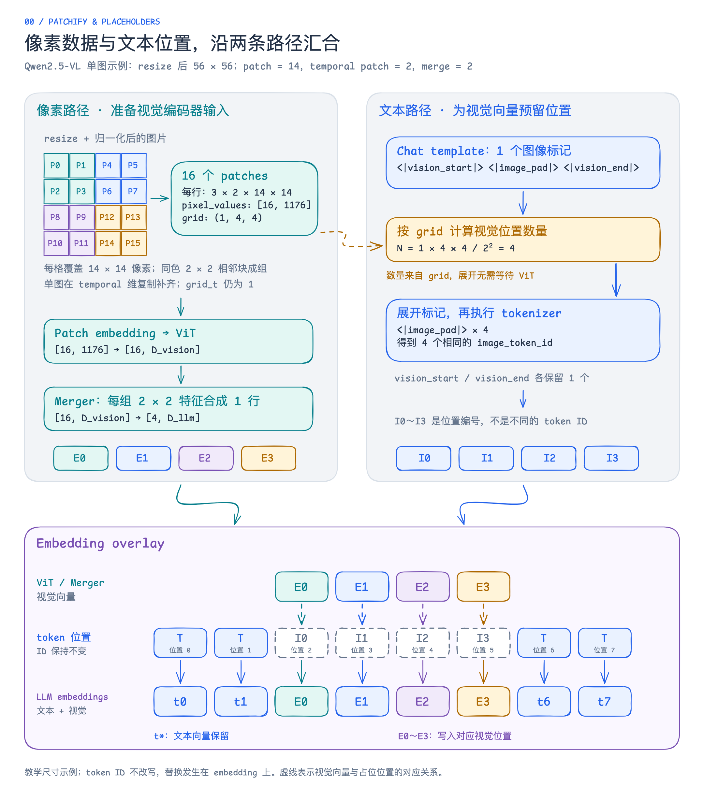
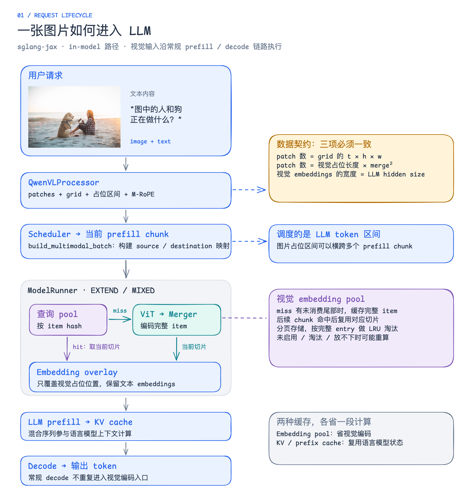
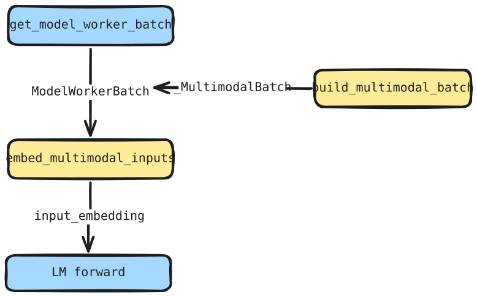
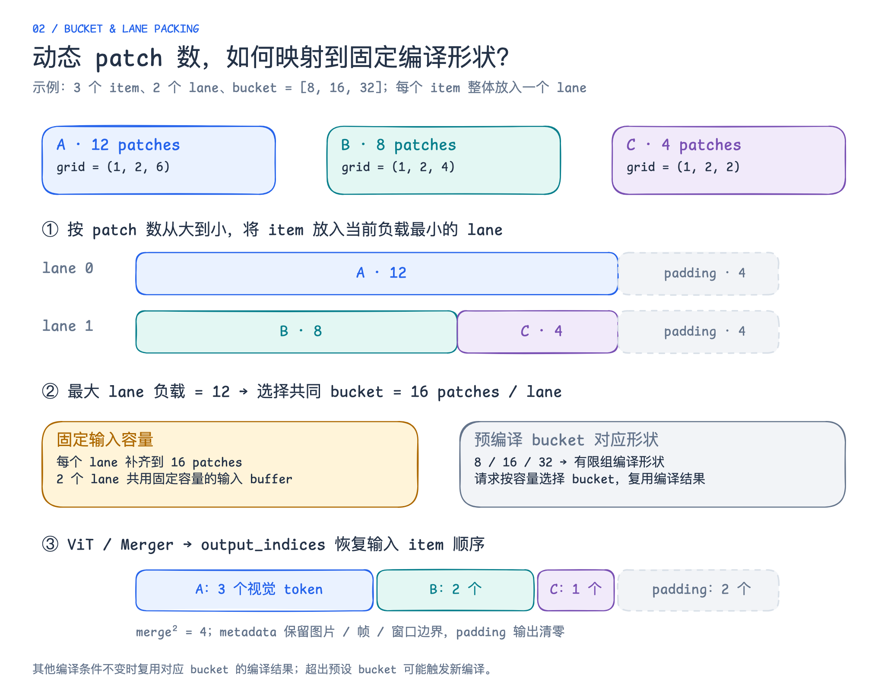
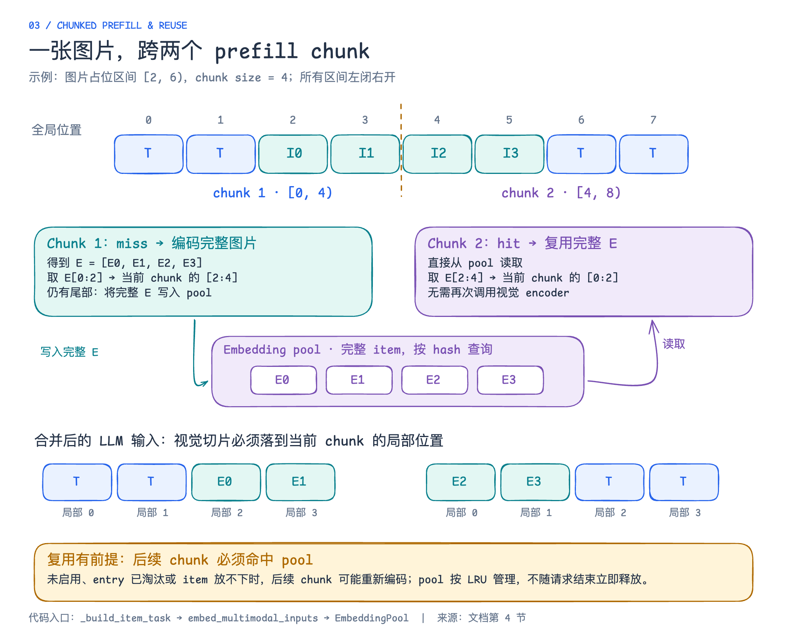
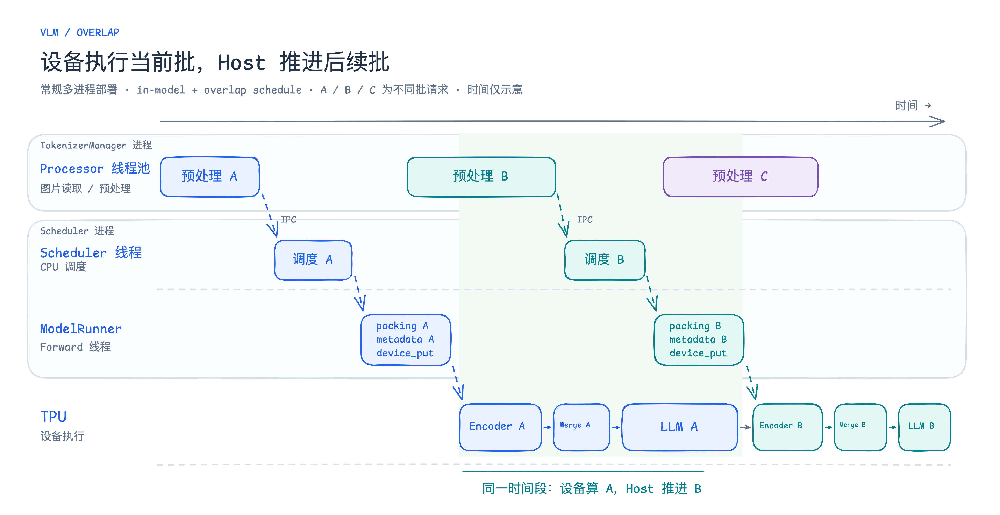
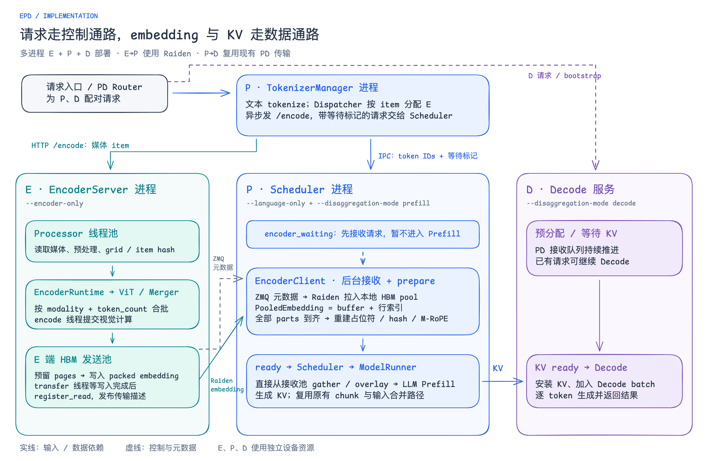
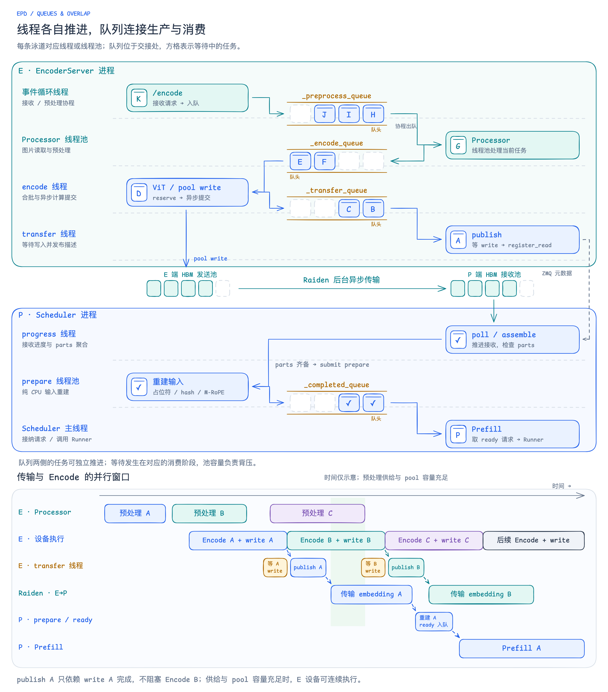

## 1. VLM组件的增量

 

## 2. 一个请求的完整流程

### 2.1 图片预处理

图片变成 patches，同时展开视觉占位位置

Processor中分成两个路径： 像素路径准备视觉编码器的输入，文本路径将文本转为input_id的同时还会为视觉embedding预留位置。

 

### 2.2 请求如何进入当前 batch

 

`build_multimodal_batch` 只为与当前 chunk **相交的视觉占位区间**创建任务。每个任务携带完整 item，以及“encoder 输出哪一段 → 当前 token batch 哪一段”的映射。

`ModelRunner.forward` 在 `EXTEND` / `MIXED` 模式调用 `embed_multimodal_inputs`，将结果写入 `forward_batch.input_embedding`，再进入语言模型 forward。常规 `DECODE` 不经过这条视觉编码入口；视觉上下文已通过 prefill 进入 KV cache。请求被 retract 后重新 prefill 时，则需要再次遵守多模态的区间与位置规则。

 

## 3. 支持动态分辨率的同时保持编译友好

 

通过 packing 与 padding，将不同分辨率的图片映射到预设 bucket 对应的固定输入形状，复用预编译结果。

把多张图packing后，出现的另一个问题是：ViT中的是无需KVcache的双向注意力。packing后变成了块对角上的注意力计算。实践上，我将RPA3 改出了一个varlenattention。

### 3.2 编译友好与代码可阅读性之间的取舍

## 4. 兼容 chunked prefill

 

chunk 控制的是这次 LLM extend 的序列范围。视觉 encoder 对 cache miss 处理完整 item，随后只把当前 chunk 需要的部分放入 LLM 输入。

对一个视觉占位区间 `[s, e)` 和当前 chunk `[c, c+n)`，先求交集 `[a, b)`：

前序区间累计长度使同一个 item 的多个占位区间也能映射到连续 encoder 输出；

## 5. VLM 下的 overlap

 

沿同一时间列看：设备执行 A 时，Host 推进后续请求；同批的 Encoder → Merge → LLM 仍按依赖执行。

## 6. 性能实测

[PR #1610](https://github.com/sgl-project/sglang-jax/pull/1610) 报告了 Qwen3-VL-32B-Instruct 在单台 TPU v7x-8 上的文本 / 单图对照：DP4 × effective TP2.

单图请求携带一张随机 512×512 JPEG，1,000 个请求以不限请求速率的 burst 负载运行。

ISL：1344, OSL：500。

| 指标  | 文本输入 | 文本+单图输入 |
|-----|-----:|--------:|
| Successful requests | 1,000 | 1,000   |
| Input tokens | 1,344,206 | 1,344,206（包括图片） |
| Output tokens | 500,000 | 500,000 |
| Duration | 55\.777 s | 58\.634 s |
| Request throughput | 17\.928 req/s | 17\.055 req/s |
| Input token throughput | 24,099.43 tok/s | 22,925.18 tok/s |
| Output token throughput | 8,964.19 tok/s | 8,527.41 tok/s |
| Total token throughput | 33,063.62 tok/s | 31,452.59 tok/s |
| Mean TTFT | 13,820.48 ms | 15,937.96 ms |
| Median TTFT | 10,933.37 ms | 13,425.55 ms |
| P99 TTFT | 46,881.43 ms | 49,192.05 ms |
| Mean TPOT | 64\.89 ms | 65\.44 ms |
| Median TPOT | 68\.54 ms | 68\.36 ms |
| P99 TPOT | 82\.26 ms | 90\.18 ms |
| Mean E2E latency | 46,201.97 ms | 48,591.19 ms |
| Median E2E latency | 45,290.66 ms | 47,598.53 ms |
| P99 E2E latency | 55,445.41 ms | 57,846.17 ms |
| Mean ITL | 66\.32 ms | 66\.64 ms |
| Median ITL | 32\.77 ms | 33\.06 ms |
| P95 ITL | 88\.20 ms | 62\.41 ms |
| P99 ITL | 371\.05 ms | 358\.61 ms |

**这组负载下，单图请求保留文本约 95% 的输出吞吐，Mean TPOT 接近文本基线，Mean TTFT 有所增加。**

## 7. EPD分离

EPD分离本质上是流水线并行和数据并行的结合，从架构上来讲还有任务并行的特点。

为什么EPD分离？

### 当前实现

 

P 端通过 `PooledEmbedding` 持有接收池的 buffer、行索引和 lease；切片、拼接只操作行索引，overlay 时再从设备池读取。请求释放后，页面还要等传输结束且所有已登记的设备读取完成，才能复用。[接收池生命周期](https://github.com/primatrix/sglang-jax/blob/2b1c144b588166e80d783f392258e5382d937a07/python/sgl_jax/srt/disaggregation/encoder/raiden_receiver.py#L192)

代码：[请求分发](https://github.com/primatrix/sglang-jax/blob/2b1c144b588166e80d783f392258e5382d937a07/python/sgl_jax/srt/managers/tokenizer_manager.py#L386) · [输入重建](https://github.com/primatrix/sglang-jax/blob/2b1c144b588166e80d783f392258e5382d937a07/python/sgl_jax/srt/disaggregation/encoder/scheduler_mixin.py) · [接收结果与 overlay](https://github.com/primatrix/sglang-jax/blob/2b1c144b588166e80d783f392258e5382d937a07/python/sgl_jax/srt/multimodal/in_model/host_orchestration.py#L295)

### 如何 overlap？

当前实现通过多个队列解耦预处理、Encode、发布与接收：**预处理 C、Encode B、传输 A 可以同时推进**。

 

Encode 线程提交 ViT 和 pool write 后，把 staged batch 放入 `_transfer_queue`，即可继续取下一批。transfer 线程等待当前批 write 完成再 publish；**publish 返回不代表传输完成**，`publish A` 只依赖 A 的 write 完成，Encode B 无需等待它；预处理供给和发送池容量充足时，E 设备可连续执行，Raiden 传输与后续 Encode 并行。

P 端接收和重建完成后放入 `_completed_queue`，由 Scheduler 取走。E 端发送池页面等写入、发送都完成后回收；页面不足时，reserve 对 Encode 施加背压。

代码：[预处理队列](https://github.com/primatrix/sglang-jax/blob/2b1c144b588166e80d783f392258e5382d937a07/python/sgl_jax/srt/disaggregation/encoder/scheduler.py#L34) · [Encode / transfer 队列](https://github.com/primatrix/sglang-jax/blob/2b1c144b588166e80d783f392258e5382d937a07/python/sgl_jax/srt/disaggregation/encoder/runtime.py#L257) · [发布与发送完成](https://github.com/primatrix/sglang-jax/blob/2b1c144b588166e80d783f392258e5382d937a07/python/sgl_jax/srt/disaggregation/encoder/raiden_transfer.py#L137) · [P 端完成队列](https://github.com/primatrix/sglang-jax/blob/2b1c144b588166e80d783f392258e5382d937a07/python/sgl_jax/srt/disaggregation/encoder/client.py#L422)

---

## 代码阅读地图

建议按照 producer → consumer 的顺序阅读，正文现场重点展开 processor、host orchestration 和 lane packing 三处。

| 文件  | 阅读重点 |
|-----|------|
| [processors/qwen_vl.py](https://github.com/primatrix/sglang-jax/blob/32684367ef96601f3b3285f9dc5e94c1be6f54f8/python/sgl_jax/srt/multimodal/processors/qwen_vl.py) | `collect_mm_items_from_processor_output`：item、占位区间、grid 与 M-RoPE |
| [in_model/interface.py](https://github.com/primatrix/sglang-jax/blob/32684367ef96601f3b3285f9dc5e94c1be6f54f8/python/sgl_jax/srt/multimodal/in_model/interface.py) | `InModelMultimodalContract`：输入 embedding、模态 encoder 与预编译接口 |
| [in_model/host_orchestration.py](https://github.com/primatrix/sglang-jax/blob/32684367ef96601f3b3285f9dc5e94c1be6f54f8/python/sgl_jax/srt/multimodal/in_model/host_orchestration.py) | `_build_item_task`、`build_multimodal_batch`、`embed_multimodal_inputs` |
| [in_model/lane_packing.py](https://github.com/primatrix/sglang-jax/blob/32684367ef96601f3b3285f9dc5e94c1be6f54f8/python/sgl_jax/srt/multimodal/in_model/lane_packing.py) | `balance_lanes`、`pack_lanes`、`run_mrope_vision_model`、输出恢复 |
| [models/qwen2_5_vl.py](https://github.com/primatrix/sglang-jax/blob/32684367ef96601f3b3285f9dc5e94c1be6f54f8/python/sgl_jax/srt/models/qwen2_5_vl.py) | ViT / Merger、metadata 与语言模型接入 |
| [models/qwen3_vl.py](https://github.com/primatrix/sglang-jax/blob/32684367ef96601f3b3285f9dc5e94c1be6f54f8/python/sgl_jax/srt/models/qwen3_vl.py) | Qwen3-VL 视觉编码和 DeepStack 特征输出 |
| [in_model/embedding_pool.py](https://github.com/primatrix/sglang-jax/blob/32684367ef96601f3b3285f9dc5e94c1be6f54f8/python/sgl_jax/srt/multimodal/in_model/embedding_pool.py) | 分页 buffer、hash 查询、LRU 和 packed scatter 写入 |
| [model_executor/model_runner.py](https://github.com/primatrix/sglang-jax/blob/32684367ef96601f3b3285f9dc5e94c1be6f54f8/python/sgl_jax/srt/model_executor/model_runner.py) | pool 容量与 `forward` 的合并入口 |
