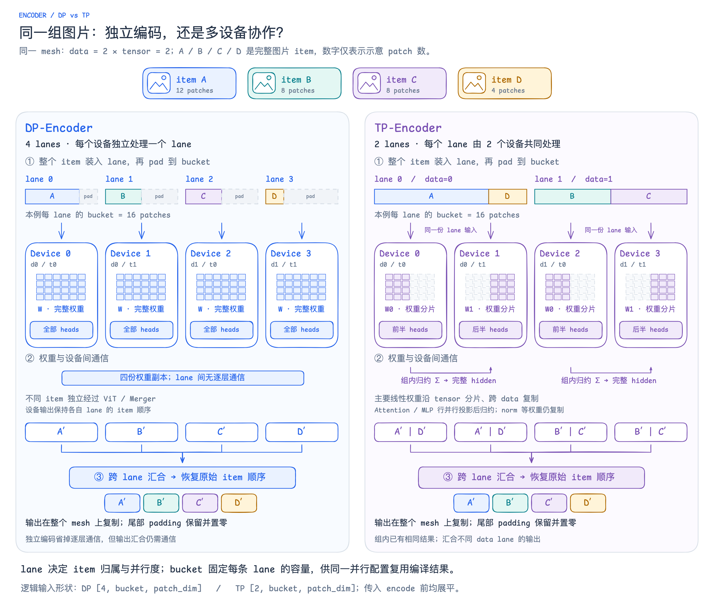

# DP-Encoder 与 TP-Encoder

[可编辑 Excalidraw](excalidraw/09-encoder-dp-tp.excalidraw) · [SVG](excalidraw/09-encoder-dp-tp.svg)

DP 在每个设备保存完整视觉权重，让不同 lane 独立编码，适合权重能放下且独立 item 足够多的批次，省去层内 TP 通信。TP 在同一个 lane 内切分主要线性权重与 attention heads，让多个设备协作处理完整 item，降低这部分权重的单设备显存占用，代价是层内归约通信，以及相同设备数下更少的独立 lane。联系前面的 packing：DP 的 lane 数为 `data × tensor`，TP 为 `data`，二者都按最大 lane 负载选择 bucket 并 padding，以便在各自固定的并行配置下复用编译结果；切换 DP / TP 会改变分片方式和逻辑输入形状。

## 实现依据

图按当前 Qwen3-VL 路径绘制；示意 patch 数用于展示整 item 分配，不是性能测量。输出汇合表示跨 lane 的数据收集、按索引恢复原顺序并复制到整个 mesh，具体 collective 由编译器决定；归约箭头表示组内协作，不表示集中到某一个设备。

- [lane 数、整 item 贪心分配、bucket 与输出重排](https://github.com/primatrix/sglang-jax/blob/2b1c144b588166e80d783f392258e5382d937a07/python/sgl_jax/srt/multimodal/in_model/lane_packing.py)：`encoder_num_lanes`、`balance_lanes`、`pack_lanes`、`restore_encoder_output`。
- [DP / TP 分片规格](https://github.com/primatrix/sglang-jax/blob/2b1c144b588166e80d783f392258e5382d937a07/python/sgl_jax/srt/multimodal/layers/vision_sharding.py)：`VisionShardSpecs`。
- [Qwen3-VL 权重、attention / MLP 与输出布局](https://github.com/primatrix/sglang-jax/blob/2b1c144b588166e80d783f392258e5382d937a07/python/sgl_jax/srt/models/qwen3_vl.py)：`Qwen3VLVisionAttention`、`Qwen3VLVisionMLP`、`_get_visual_feature`；最终 `output_sharding` 为复制布局。

本页及配图仅保存在仓库，未上传至 Outline 文档。
