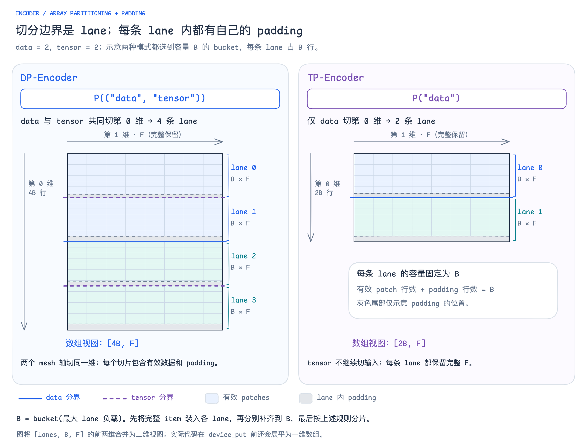

# Encoder 输入数组切分与 lane 内 padding



[可编辑 Excalidraw](excalidraw/10-encoder-input-sharding.excalidraw) · [SVG](excalidraw/10-encoder-input-sharding.svg)

先将完整 item 装入各条 lane，按最大 lane 负载选择 bucket 容量 `B`，每条 lane 都以“有效 patch 行 + 尾部 padding 行”补齐到 `B`；padding 行数可以为零。图中彩色区域表示有效 patches，灰色区域表示各条 lane 自己的 padding，右侧括号覆盖整条 `B × F` 切片。灰色尾部只示意 padding 的位置，不代表实测占比。

DP-Encoder 的 `P(("data", "tensor"))` 将两个 mesh 轴放在同一个位置，共同切分第 0 维，形成 `DP × TP` 条 lane；TP-Encoder 的输入使用 `P("data")`，仅沿 data 切分第 0 维，形成 `DP` 条 lane。两种模式的输入特征维 `F` 都完整保留。

```python
from jax.sharding import NamedSharding, PartitionSpec as P

# 两个 mesh 轴共同切分数组第 0 维。
input_sharding = NamedSharding(mesh, P(("data", "tensor")))

# 只有 data 切分数组第 0 维。
input_sharding = NamedSharding(mesh, P("data"))
```

图以 `data = tensor = 2`、两种模式恰好选到相同容量 `B` 的 bucket 为例，将 `[lanes, B, F]` 的前两维合并展示：DP 数组为 `[4B, F]`，TP 数组为 `[2B, F]`，每条 lane 都占 `B` 行。实际两种模式分别根据自己的最大 lane 负载选 bucket，容量可能不同；代码在 `device_put` 前还会将输入展平为一维数组。

蓝色实线表示 data 分界，紫色虚线表示 tensor 在 data 分块内继续切第 0 维，灰色细虚线区分 lane 内的有效数据与 padding；分片线是布局关系，不表示先后执行两次数据搬运。TP 的层内特征、权重分片及通信另见[DP / TP 完整对比](encoder-dp-tp.md)；实现依据同页所列的 `VisionShardSpecs` 与 `pack_lanes`。本页及配图仅保存在仓库，未上传至 Outline。
