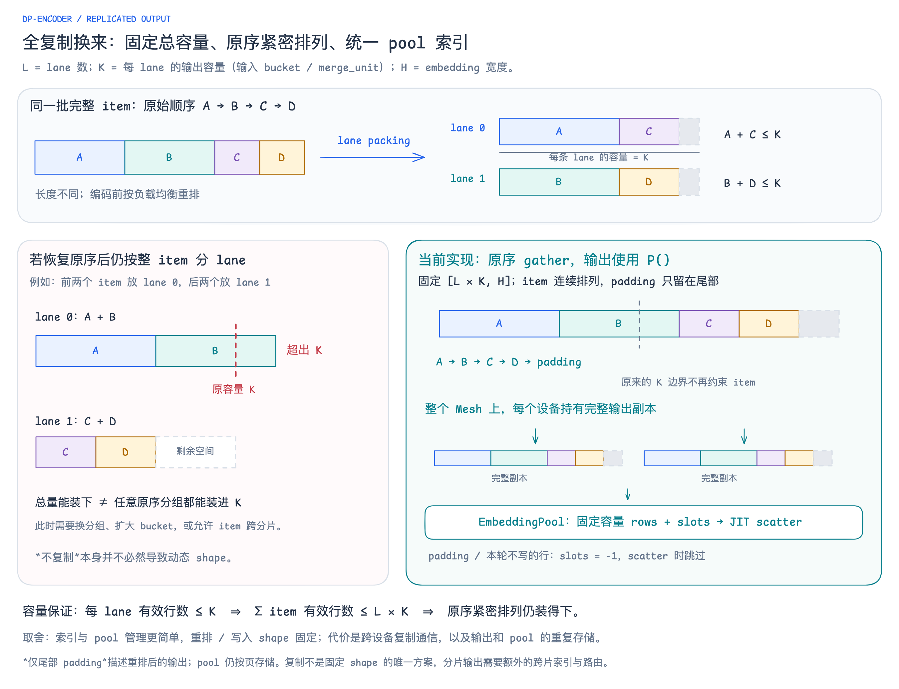

# 全 Mesh 复制输出：固定容量与管理复杂度的取舍

[可编辑 Excalidraw](excalidraw/13-encoder-replicated-output.excalidraw) · [SVG](excalidraw/13-encoder-replicated-output.svg)

输入按负载均衡装入 lane 后，每条 lane 的有效输出行数都不超过固定容量 `K`，因此总有效输出行数不超过 `L × K`。当前实现恢复原始 item 顺序时，以复制布局返回固定形状 `[L × K, H]`：有效 item 紧密排列，padding 集中在末尾并置零；这样下游可以使用统一的全局行索引，pool 写入也能保持固定容量的 rows / slots。

代价是跨设备复制通信，以及完整输出和 EmbeddingPool 在各设备上的重复存储。这里的取舍是简化索引、pool 管理和编译形状，而非声称全复制是固定 shape 的唯一方案。

## 容量与约束

- `L` 为 lane 数，`K = 输入 patch bucket / merge_unit` 为每条 lane 的输出容量，`H` 为输出 embedding 宽度；对固定的 `L、K、H`，重排前后的输出总容量均为 `L × K`，并非原始 patch 输入与 encoder 输出 shape 完全相同。
- 图中 `A+C`、`B+D` 都不超过 `K`，但恢复原序后若固定让前两个完整 item 放第一条 lane，则 `A+B` 可能超过 `K`。这是“按原序重新分组，且完整 item 不跨 lane”约束下的反例，不是所有分片布局都必然溢出。
- 固定形状的全局 packed 数组也可以继续分片，但 item 可能跨分片，需配套跨片索引、通信与 pool 布局；全复制让当前实现直接使用完整输出视图。
- “仅尾部 padding”指重排后的 packed 输出。EmbeddingPool 自身仍按页分配，页尾可能留空；写入向量长度保持总容量，padding、未被选择写入或分配失败的行使用 `slots = -1` 跳过。

## 代码依据

- [lane packing 与原序恢复](https://github.com/primatrix/sglang-jax/blob/2b1c144b588166e80d783f392258e5382d937a07/python/sgl_jax/srt/multimodal/in_model/lane_packing.py)：`pack_lanes`、`_build_output_indices`、`_restore_input_order`；索引向量保留 `L × K` 容量，尾部无效索引产生零行。
- [Qwen3-VL 输出布局](https://github.com/primatrix/sglang-jax/blob/2b1c144b588166e80d783f392258e5382d937a07/python/sgl_jax/srt/models/qwen3_vl.py#L683)：`_get_visual_feature` 将 `output_sharding` 设为 `self.visual.specs.sharding()`，即 `P()`。图中原序 gather 与复制是逻辑布局描述，具体通信由编译器决定。
- [固定容量的 pool 写入](https://github.com/primatrix/sglang-jax/blob/2b1c144b588166e80d783f392258e5382d937a07/python/sgl_jax/srt/multimodal/in_model/embedding_pool.py)：`_zeros` 创建复制的 pool，`write_packed` 复制输出并分配固定容量 slots，`_scatter_rows` 使用 JIT + donate scatter，`precompile_packed_write` 按 capacity 预编译。

图源使用 Comic Shanns，仅保存在本地仓库，未上传至 Outline。
