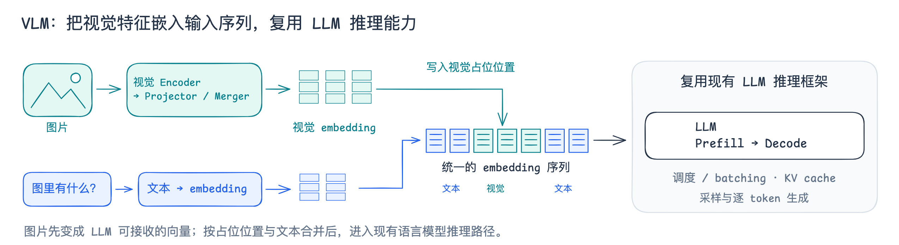

# VLM 核心原理横图

[可编辑 Excalidraw](excalidraw/12-vlm-core-principle.excalidraw) · [SVG](excalidraw/12-vlm-core-principle.svg)

建议放在文档标题下、正文之前。

图片经过视觉 Encoder 和 Projector / Merger，得到与 LLM 输入兼容的视觉 embedding；再按视觉占位位置写入文本 embedding 序列，进入语言模型，复用框架已有的调度、KV cache、Prefill / Decode 与采样能力。

本图概括本文实现的主要输入路径，彩色向量块为示意。具体接入与代码依据见[Chunk 任务与 embedding 的架构接入](chunk-embedding-integration.md)。图源使用 Comic Shanns，保存在本地仓库，未上传至 Outline。
